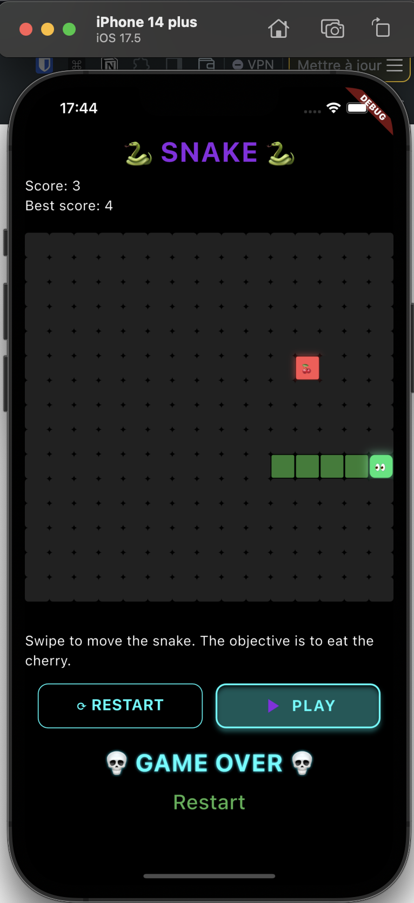

# 🐍 Snake Game (Flutter)

A simple but polished **Snake game** built with Flutter.  
Includes swipe controls, score saving, and a retro-neon vibe.



---

## ✨ Features

- 🎮 Classic Snake gameplay
- 🎨 Fancy UI with neon-like design (purple/black/cyan)
- 💾 Best score is saved locally using `shared_preferences`
- 📱 Swipe gestures for intuitive control

---

## 🎯 Game Rules

1. **Movement**

   - The snake moves continuously in one direction.
   - Use swipe gestures to change direction.

2. **Growth**

   - Eating food increases the snake’s length.

3. **Game Over**

   - The game ends if:
     - The snake hits itself.
     - _(Optional rule: if it hits the edge)_

4. **Scoring**
   - Each food adds 1 point.
   - The best score is saved locally.

---

## 🚀 Getting Started

```bash
flutter pub get
flutter run
```

## Possible upgrades

- 🎵 Add music and sound effects
- ⚡ Increase snake speed as score grows
- 🗺️ Allow different map sizes
- 🎨 Add skins or themes
